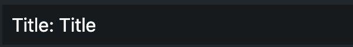

# @gpn-prototypes/vega-radio-list

Название компонента



### Установка

```
yarn add @gpn-prototypes/vega-radio-list
```

### Примеры использования

```jsx
import { RadioList } from '@gpn-prototypes/vega-radio-list';

export const MyComponent = () => {
  const title = 'Title';

  return <RadioList title={title} />;
};
```

### API

```ts
type RadioListProps = {
  title?: string;
  className?: string;
};
```
